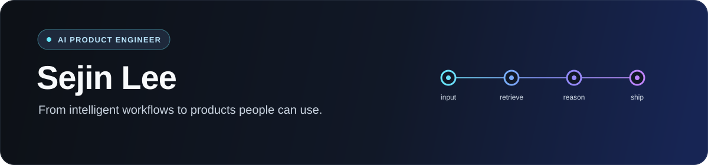

  

  <a href="https://jionc.com">jionc.com</a> ·
  <a href="https://blog.jionc.com">Blog</a> ·
  <a href="https://solved.ac/toy">Problem Solving</a>

## Hi, I'm Sejin

AI engineer building useful products with **RAG, AI agents, and full-stack systems**.

## Selected work

- **[PASS — AI Patent Assistant](https://github.com/tpwls9494/SKN09-FINAL-3Team)** — Patent drafting with Qwen3 and RAG · **₩500M saved, 672 hours → 2 minutes**
- **[jionc.com](https://github.com/tpwls9494/jionc.com)** — Developer community, MCP marketplace, and technical blog built end to end
- **[shop-rag](https://github.com/tpwls9494/shop-rag)** — Multi-tenant RAG support assistant for e-commerce sellers

## Recent work

<!-- RECENT-PROJECTS:START -->
- **[mrt-policy-checker](https://github.com/tpwls9494/mrt-policy-checker)** · `Python`
- **[Zivo](https://github.com/tpwls9494/Zivo)** · `TypeScript`
- **[openclaw-agent](https://github.com/tpwls9494/openclaw-agent)** · `Python`
<!-- RECENT-PROJECTS:END -->

## Stack

`Python` · `FastAPI` · `LangGraph` · `PostgreSQL` · `React` · `TypeScript` · `Docker` · `AWS`
